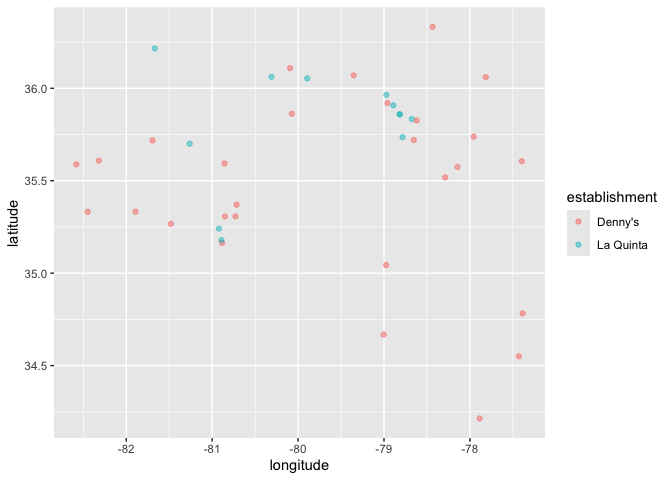
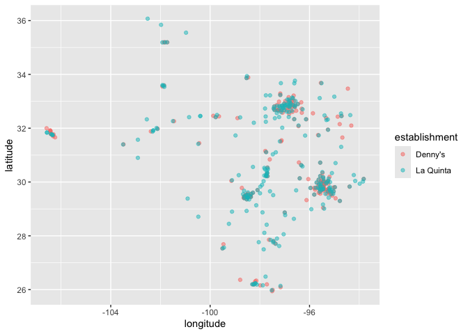

Lab 04 - La Quinta is Spanish for next to Denny’s, Pt. 1
================
Rachel Weiner
January 5, 2026

### Load packages and data

``` r
library(tidyverse) 
library(dsbox) 
data(dennys)
data(laquinta)
```

``` r
states <- read_csv("data/states.csv")
```

Based on Mitch Hedberg joke that the hotel chain, “La Quinta” translates
to “next to Denny’s” as these two locations are commonly clustered
together across American towns and cities. Let’s see where this joke
pans out according to the data.

### Exercise 1

Let’s start by collecting the dimensions of the denny’s data set.

``` r
nrow(dennys)
```

    ## [1] 1643

``` r
ncol(dennys)
```

    ## [1] 6

There are 1643 rows in the data set which each represent a different
Denny’s restaurant location. There are also six columns in this data set
which each represent a different variable regarding each Denny’s
location. The six variables include address, city, state, zip code,
longitude and latitude.

### Exercise 2

Next, let’s see about the La Quinta data set.

``` r
nrow(laquinta)
```

    ## [1] 909

``` r
ncol(laquinta)
```

    ## [1] 6

There are 909 rows in this data set each representing a different La
Quinta hotel location. There are also six columns each representing the
same six variables as listed in the Denny’s data set. (Address, city,
state, zip code, longitude, and latitude)

### Exercise 3

There are many La Quinta hotels outside of the United States including
Canada, Mexico, China, New Zealand, Georgia, and Turkiye. This
information is clearly listed on their website.

On the otherhand, Denny’s does not clearly list any restauraunts as
being outside of the United States and makes clear that they are
“America’s Diner, In your Neighborhood” suggesting that they only have
United States locations. They might have locations that are outside of
the United States but this is not made clear via their website.

### Exercise 4

As the answers above were based on each of the organization’s websites,
the data will provide a more substantive answer to the question
regarding whether these organizations have locations outside of the
United States.

The first brainstormed idea that I came up with works with the state
variable. I might be able to filter the data to reveal rows that did not
have a state mentioned. This might help me to visualize which locations,
of both companies, were not located within the United States.

### Exercise 5

Using the filter() function, I will find whether there are any Denny’s
locations outside of the United States.

``` r
dennys %>%
  filter(!(state %in% states$abbreviation))
```

    ## # A tibble: 0 × 6
    ## # ℹ 6 variables: address <chr>, city <chr>, state <chr>, zip <chr>,
    ## #   longitude <dbl>, latitude <dbl>

Based off of this, there are no Denny’s locations outside of the United
States from this data set.

### Exercise 6

Now I will add a seventh variable to the Dennys data set to reflect the
country in which each restaurant is located, which is the United States
for all locations.

``` r
dennys <- dennys %>%
  mutate(country = "United States")
```

### Exercise 7

Next, I will do some research to find the La Quinta hotel locations that
fall outside of the United States. This will help us with the next
exercise.

### Exercise 8

Now that I have an idea and some notes regarding La Quinta locations
outside of the United States, I will use the case_when function to
populate this variable.

``` r
laquinta <- laquinta %>%
  mutate(country = case_when(
    state %in% state.abb ~ "United States",
    state %in% c("ON", "BC") ~ "Canada",
    state == "ANT" ~ "Colombia",
    state == "AG" ~ "Antigua and Barbuda",
    state == "CH" ~ "Switzerland",
    state == "FM" ~ "Micronesia", 
    state == "PU" ~ "Guinea-Bissau",
    state == "QR" ~ "Qatar",
    state == "SL" ~ "Sierra Leone",
    state == "VE" ~ "Venezuela"))
```

As there are no Denny’s locations outside the United States, we are not
concerned with filtering locations for that data set. La Quinta, on the
other hand, does have locations outside of the United States and
therefore we will need to filter this data set for only locations in the
United States.

``` r
laquinta <- laquinta %>%
  filter(country == "United States")
```

### Exercise 9

Now we will calculate which states have the most and fewest Denny’s
locations.

``` r
dennys %>% 
  count(state, sort = TRUE)
```

    ## # A tibble: 51 × 2
    ##    state     n
    ##    <chr> <int>
    ##  1 CA      403
    ##  2 TX      200
    ##  3 FL      140
    ##  4 AZ       83
    ##  5 IL       56
    ##  6 NY       56
    ##  7 WA       49
    ##  8 OH       44
    ##  9 MO       42
    ## 10 PA       40
    ## # ℹ 41 more rows

``` r
data(dennys)
```

``` r
dennys2 <- dennys %>% 
  count(state)
```

According to these data calculations, California has (by far) the most
Denny’s locations with 403 total locations in the state. On the other
hand, Delaware has the fewest Denny’s locations with a grand total of
one location. This is not surprising as California is one of the largest
states and Delaware is one of the smallest states, by land area.

``` r
dennys2 <- dennys2 %>%
  count(state) %>%
  inner_join(states, by = c("state" = "abbreviation"))
```

This joined code allows us to learn exactly how many observations are in
each state using both the “states” data frame and the “dennys” data
frame.

### Exercise 10

Now that we have joined the two data sets, we are interested in learning
which state has the most Dennys location per 1000 square miles.

``` r
dennys2 <- dennys2 %>%
  mutate(density_per_1000 = (n / area) * 1000) %>%
  arrange(desc(density_per_1000)) %>%
  print()
```

    ## # A tibble: 51 × 5
    ##    state     n name                    area density_per_1000
    ##    <chr> <int> <chr>                  <dbl>            <dbl>
    ##  1 DC        1 District of Columbia    68.3          14.6   
    ##  2 RI        1 Rhode Island          1545.            0.647 
    ##  3 DE        1 Delaware              2489.            0.402 
    ##  4 CT        1 Connecticut           5543.            0.180 
    ##  5 NJ        1 New Jersey            8723.            0.115 
    ##  6 NH        1 New Hampshire         9349.            0.107 
    ##  7 VT        1 Vermont               9616.            0.104 
    ##  8 MA        1 Massachusetts        10554.            0.0947
    ##  9 HI        1 Hawaii               10932.            0.0915
    ## 10 MD        1 Maryland             12406.            0.0806
    ## # ℹ 41 more rows

According to our data output. Washington D.C. has the greatest number of
Dennys locations per 1000 square miles with 2 restaurants spanning 68.34
square miles.

On to La Quinta locations!

``` r
laquinta2 <- laquinta %>%
  count(state) %>%
  inner_join(states, by = c("state" = "abbreviation"))
```

``` r
laquinta2 <- laquinta2 %>%
  mutate(density_per_1000 = (n / area) * 1000) %>%
  arrange(desc(density_per_1000)) %>%
  print()
```

    ## # A tibble: 48 × 5
    ##    state     n name             area density_per_1000
    ##    <chr> <int> <chr>           <dbl>            <dbl>
    ##  1 RI        2 Rhode Island    1545.            1.29 
    ##  2 FL       74 Florida        65758.            1.13 
    ##  3 CT        6 Connecticut     5543.            1.08 
    ##  4 MD       13 Maryland       12406.            1.05 
    ##  5 TX      237 Texas         268596.            0.882
    ##  6 TN       30 Tennessee      42144.            0.712
    ##  7 GA       41 Georgia        59425.            0.690
    ##  8 NJ        5 New Jersey      8723.            0.573
    ##  9 MA        6 Massachusetts  10554.            0.568
    ## 10 LA       28 Louisiana      52378.            0.535
    ## # ℹ 38 more rows

Rhode Island is home to the most La Quinta locations per 1000 square
miles with one location across 1545 square miles.

Next, we will do some final code to create a scatterplot of all Dennys
restaraunt locations and all La Quinta hotel locations within the United
States.

``` r
dennys <- dennys %>%
  mutate(establishment = "Denny's")
laquinta <- laquinta %>%
  mutate(establishment = "La Quinta")
```

``` r
dn_lq <- bind_rows(dennys, laquinta)
```

``` r
dn_lq %>%
  ggplot(dn_lq, mapping = aes(
  x = longitude,
  y = latitude,
  color = establishment
)) +
  geom_point()
```

<!-- -->

As we have plotted longitude and latitude, we are able to clearly
visualize both company locations on a map-like visualization, how cool!?

### Exercise 11

Let us see about North Carolina locations.

``` r
dn_lq_nc <- dn_lq %>%
  filter(state == "NC")
```

``` r
dn_lq_nc%>%
  ggplot(dn_lq, mapping = aes(
  x = longitude,
  y = latitude,
  color = establishment
)) +
  geom_point(alpha = .5)
```

<!-- -->

This visualization graphs only the North Carolina Denny’s and La Quinta
locations. Visually, Mitch Hedberg’s joke does not appear to hold as
many of the Denny’s locations and most of the La Quinta locations do not
cluster in the same locations on the graph and are largely stand alone.

### Exercise 12

How about Texas?

``` r
dn_lq_tx <- dn_lq %>%
  filter(state == "TX")
```

``` r
dn_lq_tx%>%
  ggplot(dn_lq, mapping = aes(
  x = longitude,
  y = latitude,
  color = establishment
)) +
  geom_point(alpha = .5)
```

<!-- -->

According to this data visualization of Texas Denny’s and La Quinta
locations, Mitch Hedberg’s joke does appear to hold as most Denny’s and
La Quinta locations do cluster around each other.

Maybe the joke holds true depending on the state that you are in!

Thank you!
